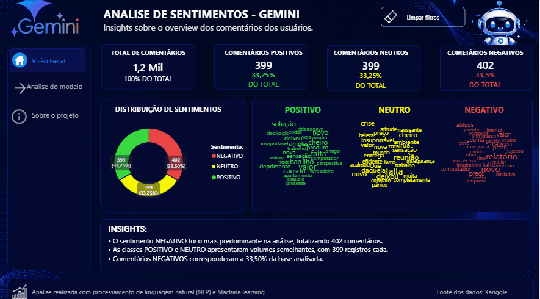

# 📊 Análise de Sentimentos com dados do Gemini

Projeto de análise de sentimentos utilizando dados do Google Gemini e regressão logistica para classificação de textos em sentimentos positivos, negativos e neutros, permitindo extrair insights a partir de avaliações, comentários e opiniões de usuários.

---

## 📌 Objetivo

Este projeto foi desenvolvido com o objetivo de aplicar técnicas de **Processamento de Linguagem Natural (PLN)** para identificar sentimentos presentes em textos utilizando modelos de IA generativa da família Gemini.

A análise de sentimentos é amplamente utilizada em:

- Monitoramento de redes sociais;
- Avaliação de produtos e serviços;
- Experiência do cliente;
- Análise de feedbacks;
- Estudos de comportamento e opinião.

---
## 🤖 Modelo de Machine Learning

Para realizar a análise de sentimentos foi utilizado um modelo de classificação supervisionada com Regressão Logística.  A Regressão Logística foi escolhida por apresentar bom desempenho em tarefas de classificação textual, além de possuir baixo custo computacional e boa interpretabilidade.

O pipeline incluiu:

- Limpeza textual;
- Tokenização;
- Vetorização dos textos com TF-IDF;
- Treinamento do modelo;
- Predição dos sentimentos;
- Avaliação dos resultados.

---

## 🚀 Tecnologias Utilizadas

- Python
- Pandas
- Google Gemini API
- Jupyter Notebook
- Matplotlib
- Seaborn
- NLP (Processamento de Linguagem Natural)

---
## 🎥 Demonstração do Projeto

<p align="center">
  
</p>
---
## 📂 Estrutura do Projeto

```bash
📁 Analise de Sentimento - GEMINI
│
├── README.md
├── requirements.txt
├── analise_sentimento.ipynb
├── dataset/
│   └── dados.csv
├── imagens/
│   └── graficos.png
```

---

## ⚙️ Etapas do Projeto

### 1️⃣ Coleta dos Dados

Os dados utilizados podem conter:

- Comentários;
- Avaliações;
- Reviews;
- Tweets;
- Feedbacks de usuários.

---

### 2️⃣ Tratamento dos Dados

Nesta etapa foram realizados processos como:

- Remoção de caracteres especiais;
- Padronização textual;
- Conversão para minúsculas;
- Tratamento de valores nulos;
- Limpeza dos textos.

---

### 3️⃣ Análise de Sentimentos

A classificação foi realizada utilizando a API Gemini, categorizando os textos em:

- 😀 Positivo
- 😐 Neutro
- 😡 Negativo

---

## 📊 Visualizações

O projeto inclui gráficos e análises visuais para facilitar a interpretação dos resultados, como:

- Distribuição de sentimentos;
- Frequência de palavras;
- Nuvem de palavras;
- Percentual de sentimentos.

---

## ▶️ Como Executar o Projeto

### 1. Clone o repositório

```bash
git clone https://github.com/Taynar4pS/Projetos_principais_Dados.git
```

### 2. Acesse a pasta do projeto

```bash
cd "Analise  de Sentimento - GEMINI"
```

### 3. Instale as dependências

```bash
pip install -r requirements.txt
```

### 4. Configure sua chave da API Gemini

Crie uma variável de ambiente com sua chave:

```bash
GEMINI_API_KEY=sua_chave
```

Ou configure diretamente no notebook/script.

---

### 5. Execute o projeto

```bash
jupyter notebook
```

Abra o notebook principal e execute as células.

---

## 📈 Resultados

Com este projeto é possível:

- Identificar tendências de opinião;
- Avaliar satisfação de usuários;
- Extrair insights estratégicos;
- Automatizar análises textuais;
- Aplicar IA generativa em problemas reais de dados.

---

## 🧠 Conceitos Aplicados

- Processamento de Linguagem Natural (PLN)
- Inteligência Artificial Generativa
- Análise de Sentimentos
- Limpeza e transformação de dados
- Visualização de dados

---

## 📚 Referências

- Google AI Studio  
- Documentação Gemini API  
- Pandas Documentation  
- Scikit-Learn Documentation  

---
## Link do Dashboard Publicado
```
<iframe title="AnaliseSentimental-Gemini" width="600" height="373.5" src="https://app.powerbi.com/view?r=eyJrIjoiMWZlOTcyZGQtMzY5NC00MTI2LTk0YTMtNGQwY2VhYzU3YzdjIiwidCI6IjE0Y2JkNWE3LWVjOTQtNDZiYS1iMzE0LWNjMGZjOTcyYTE2MSIsImMiOjh9" frameborder="0" allowFullScreen="true"></iframe>
```
---
## 👩‍💻 Autora

Desenvolvido por **Taynara Paula**  
📊 Estudante e entusiasta da área de Dados, IA e Machine Learning.

---

## ⭐ Contribuição

Sinta-se à vontade para abrir issues, sugerir melhorias ou contribuir com o projeto.

---

## 📄 Licença

Este projeto está sob a licença MIT.
