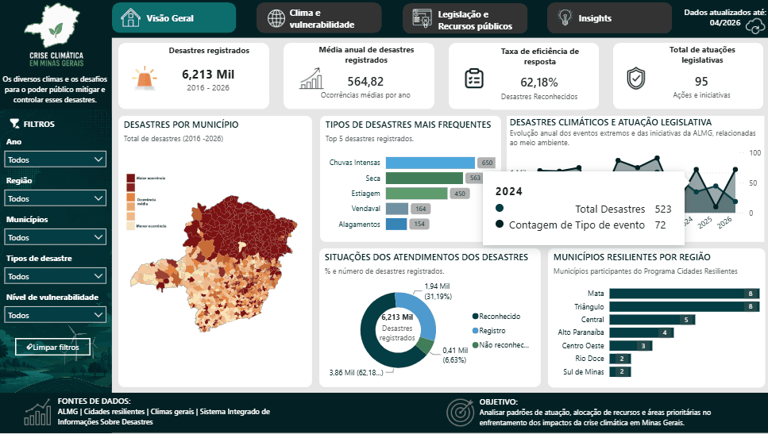

# 🌎 Análise da Crise Climática em Minas Gerais

Projeto desenvolvido em grupo durante a disciplina de **Banco de Dados** da **PUC Minas**, com o objetivo de integrar diferentes bases públicas sobre a crise climática em Minas Gerais e transformá-las em informações estratégicas por meio de um dashboard interativo no Power BI.
A proposta busca identificar padrões regionais de risco climático e apoiar a tomada de decisão baseada em dados, com foco em políticas públicas, prevenção de desastres e priorização de investimentos em áreas críticas.

<p align="center">
  
</p>

## 📊 Dashboard Interativo

🔗 **Acesse o dashboard publicado:**

https://app.powerbi.com/view?r=eyJrIjoiMjg4ODg3MDQtNGU3MS00ZGVkLWJhMjYtOGFkYjMwYzA4ZmM2IiwidCI6IjE0Y2JkNWE3LWVjOTQtNDZiYS1iMzE0LWNjMGZjOTcyYTE2MSIsImMiOjh9

---
## 🎯 Problema de Negócio

A crise climática não afeta todas as regiões de forma igual.

Em Minas Gerais, diferentes municípios apresentam níveis distintos de vulnerabilidade relacionados a fatores como:

- Desastres naturais (enchentes, secas, deslizamentos)
- Condições socioeconômicas
- Infraestrutura urbana e ambiental
- Uso do solo e degradação ambiental

**Pergunta central do projeto:**

> Quais regiões de Minas Gerais estão mais expostas e vulneráveis aos impactos climáticos, e como os dados podem apoiar decisões públicas mais eficientes?

---

## ❓ Perguntas de Análise

- Quais municípios apresentam maior vulnerabilidade climática?
- Existe relação entre vulnerabilidade social e ocorrência de desastres?
- Quais regiões concentram maior risco ambiental?
- Há padrões territoriais claros de exposição à crise climática?
- Como os dados podem apoiar políticas públicas de mitigação e adaptação?

---

# 🎯 Objetivo

Construir um pipeline completo de dados capaz de integrar diferentes bases públicas relacionadas à crise climática, permitindo analisar:

- Eventos climáticos extremos;
- Vulnerabilidade dos municípios;
- Atuação do poder público;
- Emendas parlamentares;
- Indicadores para apoio à tomada de decisão.

---

# 🏛️ Fontes de Dados

- Sistema Integrado de Informações sobre Desastres (S2ID)
- Clima Gerais
- Assembleia Legislativa de Minas Gerais (ALMG)
- Programa Cidades Resilientes

---
## ⚙️ Metodologia

O projeto seguiu as seguintes etapas:

1. Coleta e consolidação de dados públicos  
2. Tratamento e limpeza dos dados  
3. Análise exploratória (EDA)  
4. Identificação de padrões espaciais e sociais  
5. Construção de indicadores de vulnerabilidade  
6. Geração de insights para suporte à decisão  

---
# ⚙️ Pipeline de Dados

```text
Fontes Públicas
        │
        ▼
 Extração dos Dados
        │
        ▼
 Limpeza e Padronização
        │
        ▼
 Integração das Bases
        │
        ▼
 Azure SQL Database
        │
        ▼
 SQL Server
        │
        ▼
 Consultas SQL
        │
        ▼
 Power BI
        │
        ▼
 Dashboard Interativo
```

---
## 📈 Principais Insights

- Municípios com menor infraestrutura tendem a apresentar maior vulnerabilidade a eventos climáticos extremos  
- Regiões com histórico de desastres recorrentes indicam padrão de risco contínuo  
- Existe correlação entre vulnerabilidade social e exposição a eventos climáticos  
- Áreas mais urbanizadas apresentam maior resiliência relativa  

---

## 🧠 Recomendações para Tomada de Decisão

Com base nos dados analisados, recomenda-se que gestores públicos:

- Priorizem investimentos em municípios mais vulneráveis  
- Direcionem políticas de prevenção de desastres naturais  
- Melhorem infraestrutura urbana em áreas críticas  
- Monitorem regiões com maior risco ambiental em tempo quase real  
- Integram dados climáticos e sociais no planejamento estratégico  

---

# 🛠️ Tecnologias Utilizadas

- Microsoft Azure
- SQL Server
- SQL
- DBeaver
- Microsoft Excel
- Power BI
- Power Query
- DAX

---

# 📁 Estrutura do Projeto

```text
📦 Projeto
│
├── datasets/
│   ├── raw/
│   └── processed/
│
├── scripts/
│   ├── create_tables.sql
│   ├── insert_data.sql
│   ├── consultas.sql
│   └── views.sql
│
├── outputs/
│   ├── CriseClimatica.gif
│   ├── Dashboard.pbix
│   ├── Dashboard.pdf
│   └── Apresentacao.pdf
│
└── README.md
```

---

# 📈 Principais Funcionalidades

- Dashboard interativo
- Indicadores estratégicos
- Mapas temáticos
- Análises por município
- Filtros dinâmicos
- Visualização de eventos climáticos
- Integração entre diferentes bases públicas

---

# 💡 Competências Aplicadas

- ETL
- Engenharia de Dados
- Banco de Dados Relacional
- Modelagem de Dados
- SQL
- Microsoft Azure
- SQL Server
- Power Query
- DAX
- Business Intelligence
- Storytelling com Dados

---
## 📌 Conclusão

Este projeto demonstra como dados públicos podem ser transformados em insights acionáveis para apoiar políticas de adaptação e mitigação da crise climática.

O objetivo é aproximar a análise de dados da tomada de decisão real, contribuindo para uma gestão pública mais eficiente e orientada por evidências.

---

# 👥 Equipe

Projeto desenvolvido em grupo durante a disciplina de **Banco de Dados – PUC Minas**.
Integrantes: Davi Ferreira, Henrique Pietro, Taynara Puala, Thaís Gonçalves, Willian César.

---

## ⭐ Se este projeto foi interessante para você, deixe uma estrela no repositório!
